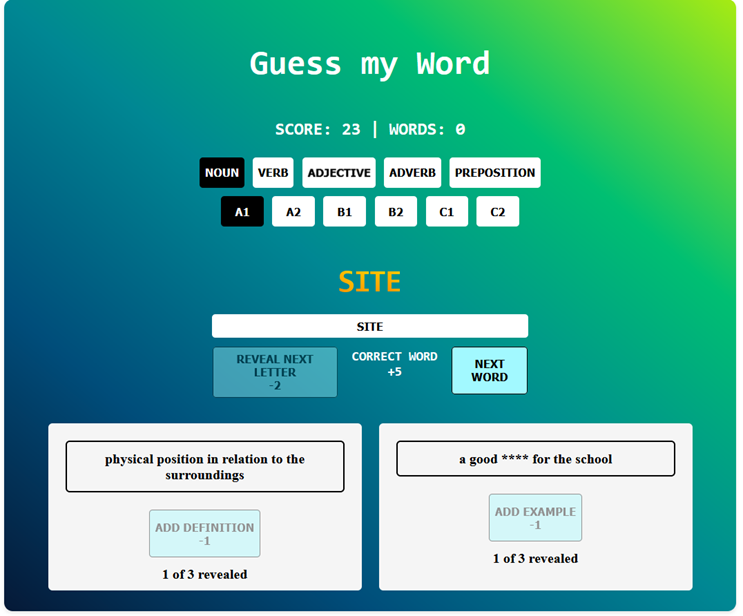
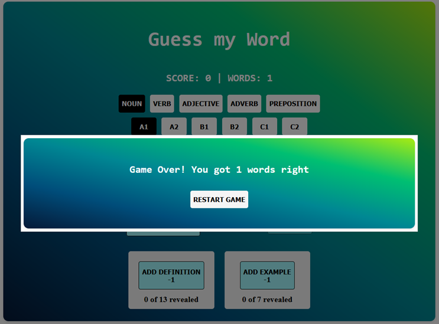
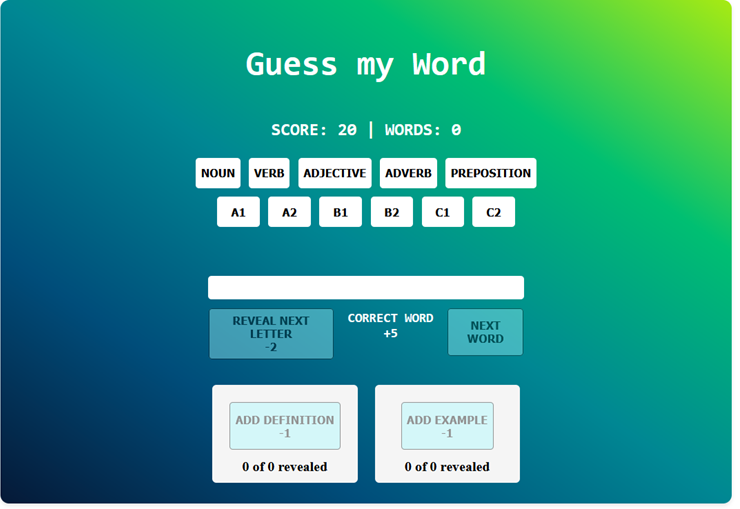
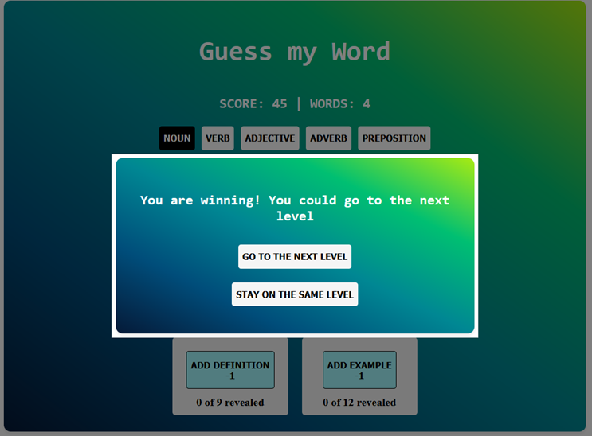
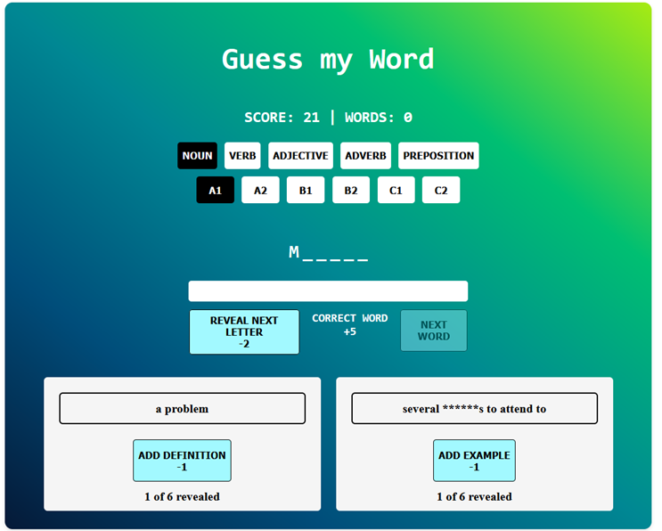
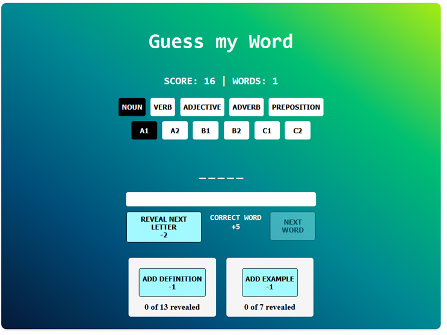

# GuessMyWord

🎉 This repository contains a basic implementation for a game for computer-assisted language learning. 🎮

[](https://github.com/Altishofer/GuessMyWord/issues)
[](https://github.com/Altishofer/GuessMyWord/pulls)

The instructions below will guide you on how to set up and run the project locally.

## Prerequisites

Before getting started, make sure you have the following prerequisites:

- [Node.js](https://nodejs.org/en)
- [Gatsby.js](https://www.gatsbyjs.com)

You can install Gatsby.js globally by running the following command in your shell:

```shell
npm install -g gatsby-cli
```

## Installation

Follow these steps to set up the project:

1. Install prequisites
2. Clone this repository to your local machine:

   ```shell
   git clone https://github.com/Altishofer/GuessMyWord.git
   ```

3. Change into the cloned repository directory:

   ```shell
   cd GuessMyWord
   ```

4. Install project dependencies:

   ```shell
   npm install
   ```

5. Build the software:

   ```shell
   npm run build
   ```

6. Start the web server:

   ```shell
   npm start
   ```

7. Open your favorite browser and have fun! 🎉
   ```shell
   http://localhost:8000/
   ```

### Impressions

#### word guessed correctly


#### game over


#### landing page


#### level up logic


#### revealed letter, example and definition


#### selection of CEFR and POS


